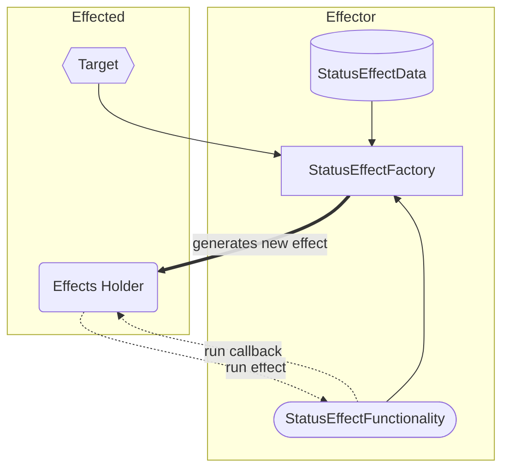

# Status Effects System

## Idea

For this guide, you will get a status effect system working. The way we will do this is by using scriptable objects as "factories" to produce status effects tailored to each target and data. The work has been adapted from [A Framework for Status Effects in Unity](https://straypixels.net/statuseffects-framework/). Below is an abstract idea for how the status effect should flow in the game.


## Coding

### Part 1: Creating Generic Status Effects Factory

For this first part, you will create a script "factory", which will allow other scripts to generate status effects as a scriptable object. To keep the number of classes organized, create a separate folder to hold the Generic Status Effects scripts. There will be 4 types of classes to code in this section: a data class holding information about the status effect, the status effect functionality, an interface for the status effect holder, and the status effect factory script itself.

1. Create a new C# script for the general **status effect data** (referred to as `[CLASS_#1]`).
   * All classes that inherit from this script will hold data required for a status effect to function. It should **not** contain any functions that change any data.
   * First, serialize the class using `System.Serializable` so that the variables will appear in the inspector.
   * Next, this is just a plain C# class, so remove the `MonoBehavior`.
   * For the current class, add some `public` data that are common to all status effects. For example, duration of the effect and chance of effect occurring.
   * That will be all for this class.
2. Create a new C# script for the general **status effect** itself.
   * This class will have the functionality of the status effects. To allow it to work with arbitrary data, you will split the class into a generic and non-generic version.
   * Add using `UnityEngine.Events` before the class implementation.
   * Non-generic class (referred to as `[CLASS_#2A]`):
     * This class needs to hold the common functions that all status effects need to implement.
     * Make the class `abstract` and remove `MonoBehavior`.
     * There are 3 functions:
       1. A lambda that will get the string name of the `Effects` class. Use the `.ToString()` method on `this`.
       2. A virtual function (referred to as `[FUNC_#1]`) that will return a float for the immunity time (the time after all the effects of the same type wear off). By default, it can return zero.
       3. A virtual function (referred to as `[FUNC_#2]`) that will run the status effect and return nothing. It takes two parameters: `[TYPE OF SCRIPT #1]` for the status effect holder and a `UnityAction<[CLASS_#2A]>` for the callback function.
          * Why do you need the two parameters? The first one allows you to check if the holder has some effect you want to depend on or utilize. The second allows you to call a function back after the effect finishes.
   * Generic class (referred to as `[CLASS_#2G]`):
     * The generic class extends the non-generic class by allowing adding data and a target.
     * Below the current class, create another abstract class with the same name. After the name add angular brackets (`<>`) and put the name `DataType` (if you change the name, be consistent with the change). After that inherit from the class above (add the non-generic class after the `:`).
     * Inside, add two public variables:
       1. A game object for the target of the status effect
       2. A `DataType` for the status effects data.
   * You are now done with this script.
3. Create a new C# script for the **status effect holdable** (referred to as `[INTERFACE_#1]`). Since this is an interface, general convention says to start the name with a capital `I` (e.g. `IInterfaceName`).
   * This will be an interface which contains all the functions necessary for an object to hold status effects.
     * Interfaces are like inheritance, but they only hold functions and you can *implement* multiple interfaces.
   * Replace `class` with `interface`.
   * Inside, there is only two functions for now (No need to implement the function, it acts like an abstract function by default.):
     1. `public bool HasEffect<T>()`
        * Remember: `<T>` means that this is a generic function which takes type `T`, allowing it to look for any effect type in-place of `T`.
     2. `public void AddStatus([CLASS_#1] effect)`
        * This can add status effects to the holder
   * This is all you will need for the interface for now.
4. Create a new C# script for the general **status effect factory**.
   * This class will create the status effect based on the data and target. Just like the previous script, you will split the class into a generic and non-generic version.
   * Non-generic class (referred to as `[CLASS_#3A]`):
     * Make the class `abstract` and have it inherit from `ScriptableObject`.
     * Inside, add a single abstract function to create a new status effect:
       * It takes in a game object for the target.
       * It returns a non-generic status effect (i.e. `[CLASS_#2A]`)
   * Generic class (referred to as `[CLASS_#3G]`):
     * The generic class extends the non-generic class by allowing adding data and a target.
     * Below the current class, create another abstract class with the same name. After the name add angular brackets (`<>`) and put the names `DataType` and `EffectType` (if you change the names, be consistent with the change).
     * After that inherit from the non-generic class (`[CLASS_#3A]`) and then add this line `where DataType: [CLASS_#1] where EffectType: [CLASS_#2A]<DataType>, new()`
       * The `where` clause is constraining the types that are allowed by the generic class. For our case, the data type can only be any class that inherits from the class in the second script and the effect type can only be any class that inherits from the class in the third script, as well as having a constructor with `new`.
     * Inside, add a `DataType` variable for the status effects data
     * Override the create new status effect from the non-generic function. If a random number is less than the status effect data's chance variable, it will return a new `EffectType {}`. Inside the `{}` set the data equal to this status effect's data and the target equal to the target passed into the function. Otherwise, it will return `null`. Here is how the structure might look inside the function:

     ```csharp
      if (RNG_number < data.chance)
          return new EffectType { data = this.data, target = target }
      else
          return null
     ```
   * You are now finished with the script.

### Part 2: Status Effects Holder

Now that the status effects scripts are finished, you need to have a script dedicated to holding the status effects as they are generated.

* Create a new C# script for **status effects holder**
* Before implementing the holder itself, let's add a helper class for status effects information (referred to as `[CLASS_#4]`)
  * Add another public class for the info
  * Add the `System.Serializable` attribute to the class
  * Add some public variables for some status effects information. Here are the ones I included:
    1. A bool for checking if the status is on cooldown (referred to as `[VAR_#1]`)
    2. A float for the cooldown timer accumulator (will keep track of how long to make the cooldown, referred to as `[VAR_#2]`)
    3. An int for the number of current count of status effects stacked (referred to as `[VAR_#3]`)
  * This should be all for this class, you can go back to the main class.
* After `MonoBehavior`, add a comma and the name of the status effect holdable interface `[INTERFACE_#1]`
* Inside, the only variable you will need is a `SerializedDictionary` which holds a `string` as the key and `[CLASS_#4]` as the value.
* Add a function and coroutine to handle the event when the status effect finishes
  1. The coroutine handles the immunity cooldown. The only parameter it takes is `[CLASS_#4]` for the status information
     * Inside, set `[VAR_#1]` of status information to true. Yield for the `[VAR_#2]` in status information amount. After that, set `[VAR_#1]` to false.
  2. The public function is the callback for when the status effect finishes. It takes as input `[CLASS_#2A]` for the effect that just finished and returns nothing.
     * This has one temporary variable of type `[CLASS_#4]`, which holds the status info of that effect.
     * First, try to get value in dictionary based on the effect name (use the `.name` lambda). If no key is found, immediately return. If the key is found, store the value in the temporary variable.
     * Next, subtract 1 from `[VAR_#3]` inside the temporary variable
     * Then, add the value of `[FUNC_#1]` from the effect to `[VAR_#2]` value inside the temporary variable
     * Now, if `[VAR_#3]` inside the temporary variable is zero, start the immunity coroutine from above. Otherwise, run the effect again, passing in `this` and the current function's name as parameters. 
     * That should be all for the current function.
* Since the status effects holder implements the holdable interface, you'll also need to implement its functions (just like an abstract class). Override these functions:
  1. `HasEffect<T>`:
     * This returns if the dictionary contains the key: `typeof(T).ToString()` (This gets the simple class name of the "effect" type and looks for it).
  2. `AddStatus`:
     * This has one temporary variable of type `[CLASS_#4]`, which holds the status info of that effect
     * First, if the effect parameter is null, immediately return from the function (there is no status effect to add)
     * Next, add an `if-else` statement:
       * If condition: Try to get the value from the dictionary with the key of effect name. 
            * If the value is found, save it to the temporary variable. Inside the `if`, add another `if` statement, which checks if the temporary variable's `[VAR_#1]` is false. If it is, then increase status effect count in the temporary by 1. Otherwise, just return nothing (cannot run effect if target is currently immune).
            * Otherwise, in the `else`: 
                1. Create a new `[CLASS_#4]` and save it to the temporary variable.
                2. Set `[VAR_#3]` in the temporary to 1
                3. Add the effect name and temporary variable to the dictionary.
                4. Run the effect, with parameters `this` and the callback function from above.
* This should finish up your script.

### Part 3: Improving Bullet Damage

For this part, we will make the bullet a bit more generic and allow the controller to send status effects to whatever it collided with.

1. Add this new counter value function into the `SerializedDictionaryExtension` class (inside the `TurretConfiguration` script).

```csharp
    public static int CounterValue(this SerializedDictionary<TypeOfUpgrade, int> dictionary, TypeOfUpgrade key)
    {
        return dictionary.ContainsKey(key) ? dictionary[key] : 0;
    }
```

2. Move the `DamageCalculation()` function from `BulletController` script to `BulletSetup` script. To fix the errors:
   * Add a parameter `SerializedDictionary<TypeOfUpgrade, int>` for the upgrade counter (called `[VAR_#4]`)
   * Replace all `bscript` with `this`
   * Replace all the `getCounter` with `[VAR_#4].CounterValue` (keep the same parameter)
3. In the `BulletSetup`, add a list that will hold the status effects **factory** (use the non-generic version, i.e. `[CLASS_#3A]`)
4. Go to the `OnTriggerEnter2D` function in the `BulletController` script
   * For the `var damageType` line, you can add `bscript` before the `DamageCalculation` to use the new function, and add `upgradesCounter` to the parameter.
   * Add another, separate `if-statement` that will check if the collision object has your status holder component. If it does:
     * For each status effect in the bscript's effects list, create the status effect and add it to the holder component.

With that, you are now finished updating the scripts.

### Part 4: Template for implementing status effects

Now that the status effect base class and holder are complete, you can now work on implementing some status effects. Since you will need a lot of them, its best to create a script template custom to this project to generate the boilerplate code. You can follow this video tutorial for guidance: [https://youtu.be/M3uQUhWmvGo](https://youtu.be/M3uQUhWmvGo).


Here is an example to follow along with when creating your template (use `#SCRIPTNAME#` in-place of `EXAMPLE_STATUS_EFFECT` and replace the templated `[class]` names with your class names when making your template):   


```csharp
// This file would have been named: EXAMPLE_STATUS_EFFECT

using System.Collections;
using UnityEngine;
using UnityEngine.Events;

[CreateAssetMenu(fileName = "New EXAMPLE_STATUS_EFFECT", menuName = "Status Effect/EXAMPLE_STATUS_EFFECT")]
public class EXAMPLE_STATUS_EFFECT_Factory : [CLASS_#3G]<EXAMPLE_STATUS_EFFECT_Data, EXAMPLE_STATUS_EFFECT>{}

[System.Serializable]
public class EXAMPLE_STATUS_EFFECT_Data: [CLASS_#1]
{
   // Put additional data here for the status effect
}

public class EXAMPLE_STATUS_EFFECT: [CLASS_#2G]<EXAMPLE_STATUS_EFFECT_Data>
{
    public override float [FUNC_#1]
    {
        // return the immunity timer amount
    }

    public override void [FUNC_#2]([INTERFACE_#1] statusEffectsHolder, UnityAction<[CLASS_#2A]> callback)
    {
        // Add functionality here
        // You can use helper functions from below
        // Don't forget to invoke the callback with the 
    }

    // Put additional helper functions/coroutines here
}
```
