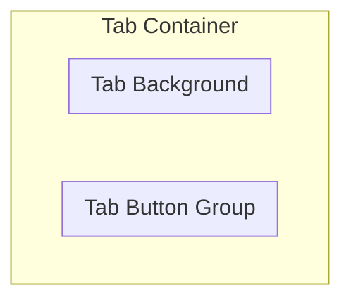

# Generating Tabs and Buttons

## What we have
* Done and unlikely to change:
    * Tab Button
    * Tab Group
    * TabScriptableObject
* May change later:
    * TurretButtonInitializing
* Script to update:
    * TabInitializer
    * TurretButtonListGeneration

## Overview of UI Structure
Here is the basic structure we will try to setup for the full UI:
* Tab Container (has TurretButtonListGeneration and BuyTurretScript)
    * Tab Button Group (has TabGroup script and horizontal layout group)
        * [List of Tab Buttons] (each has TabButton Script)
    * Tab Background (has a horizontal layout group)
        * [List of Turret Buy Buttons] (has regular Button component)

To allow that structure, you will need to create two prefabs (as well as some minimum required components):
1. turret buy button
    * Button
    * TurretButtonInitializing
2. tab button
    * TabButton
    * TabInitializer

## Flow of how UI gets created:
* Start with just Tab Container, Tab Button Group, and Tab Background (all their variables should be initialized before the scene starts)

* At the start of the scene for TurretButtonListGeneration:
    1. Generate the "All Category" tab:
        1. Instantiate a tabPrefab
        2. Put the new tab object under the Tab Button Group
        3. Get the TabButton component and add a listener to the onTabSelect event, which will run SelectivelyToggleButtons with parameter null
    
    2. Generate each of the buttons for every Turret Setting
        1. Instanitate a turretButtons prefab
        2. Put the new tab object under the Tab Background
        3. Get the TurretButtonInitializing component and initialize it with the TurretSettings
        4. Get the Button component and add a listener to the OnClick event that will run the a lambda which will call BuyTurret (from the BuyTurretScript on the Tab Container) with parameter
    
    3. Generate the tab buttons for every TabScriptableObject
        1. Instantiate a tabPrefab
        2. Put the new tab object under the Tab Button Group
        3. Get the TabInitializer and initialize it with the TabScriptableObject
        4. Get the TabButton component and add a listener to the onTabSelect event, which will run SelectivelyToggleButtons with parameter TabScriptableObject

## Main things to do:
* Add some class variables to hold the "All Tab" gameObject
* Move the GenerateButtons(allTab) and GenerateEachTabCategory()