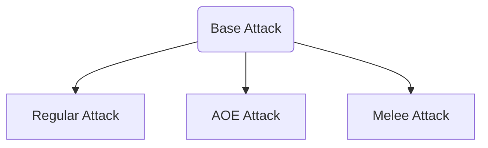

# Multiple Turret Types Guide
## Idea
For this guide, we will want to create a base class for different turret types, to allow for multiple different types of turrets (regular, AOE, and melee). Here is an illustration of the structure below.


## Turret Types
### Base Turret Attack Type Script
* We will use inheritance to allow different types of turrets to do similar things. This means we will need a base type of attack that has all the common component used by all attack types. 
* For convenience, open the `TurretConfiguration` script and add this extension all the way at the end:
    ```csharp
    public static class SerializedDictionaryExtension
    {
        public static int CounterValue(this SerializedDictionary<TypeOfUpgrade,UpgradeCounterInfo> dictionary, TypeOfUpgrade key)
        {
            return dictionary.ContainsKey(key)? dictionary[key].Counter : 0;
        }
    }
    ```
    * This will allow you to get the counter value outside the `TurretConfiguration` script.
* Next, create a new C# script for your base turret attack (shall be known as `TOWER_ATTACK_TYPE` from this point).
* Add the keyword `abstract` in-between `public` and `class` (i.e. it should say `public abstract class`)
* Inside the class, remove the Start and Update functions
* The class has 6 `protected` variables (`protected` is `private` to everyone except subclasses): 
    1. `List<GameObject>`: Holds the list of all targets within range. Set it equal to a new list.
    2. `List<Transform>`: Holds all the firepoint locations. Set it equal to a new list.
    3. `bool`: Tells whether the attack is on cooldown. Default to false
    4. `TurretSetting`: Holds the turret settings.
    5. `SerializedDictionary<TypeOfUpgrade, UpgradeCounterInfo>`: Holds the upgrades
    6. `GameObject`: Holds the bullet prefab (needed for now, can be removed later).
* To allow for default implementations, we will use `virtual` instead of `abstract` for our functions:
    * Recall, `virtual` means that subclasses can optionally override the function, while `abstract` means that it must override the function. We will use `virtual` since most of the functionality is the same between classes.
* Here are all the major functions the class will need (remember to add `virtual` after the `public/private`):
    1. A `public void` that initializes script. Has 1 parameter (`TurretConfiguration`) and returns nothing.
        * My function has a single `foreach` loop and 1 temporary `GameObject` variable
        * First, set variable #4, #5, and #6 equal to the parameter's `tsettings`, `upgradesCounter`, and `bulletPrefab` respectively. Then, add a `foreach` loop that gets every firepoint info in variable #4's `firepointPositionRotation`. Inside the loop, do the following:
            * Create a new `GameObject` with the name "FirePoint" and assign it to a temporary variable
            * Set the parent of the temporary variable equal to this transform
            * Set the position of the temporary equal to the firepoint info's position
            * Set the euler rotation of the temporary equal to `Vector3.forward` multiplied by the firepoint info's value
            * Add the temporary variable to the firepoint list.
    2. A `public void` function that updates the target list. Has no parameters and returns nothing.
        * You can leave this blank for now.
    3. A `public void` that adds a target to the list of targets. Has a single parameter: the `GameObject` possible target to add. It returns nothing.
        * Inside, you will check if the target has an `EnemyController` component. If it does, you can add it to the list and call function #2. 
    4. A `public void` that removes a target to the list of targets. Has a single parameter: the `GameObject` possible target to remove. It returns nothing.
        * This has the same structure as the function #3. The difference is that the conditional just has to check if target list contains the possible target and `Add` is changed to `Remove`.
    5. A `public void` function that performs some kind of attack. This has 1 parameter: a `float` for cooldown timer.
        * By default, if the cooldown bool is false, then the attacking coroutine will be started (see function #6).
    6. A `protected IEnumerator` coroutine that has a single parameter for the cooldown time. This will actually preform the attack.
        * For the base class, just yield the cooldown time (we will override the functionality later).
    7. `public void` that will Aim the turret to the target. Has no parameters.
        * You can leave this blank.
* One last thing is to move the helper static function `FindEnemyDistance` from `TurretConfiguration` to your new script for convenience.
### Main Turret Attack Types
Now that we have the base class finished, you can create two separate scripts for the turret types. Remember that for each attack type you will need to replace `MonoBehavior` with `TOWER_ATTACK_TYPE` (meaning your scripts will inherent from the base class).
* Regular Attack: 
    * Since this is the normal turret, we will carry over the same settings as in `TurretConfiguration`
    * Create a new C# script for this and remove Start and Update. Also remember to change `MonoBehavior` to `TOWER_ATTACK_TYPE`.
    * Add a single private `GameObject` for the current target
    * For almost all of the functions, we will be overriding it from the base class. This means that it will share the same function signature but have the word `override` in place of virtual. Also, if there is code in the base class you want to call, you can do `base.[functionName](same parameters)`. Here are a few examples of how overriding looks like:
    ```csharp
    public override void Example1()
    {
        // Can directly call base function if there is no custom code
        base.Example1();
    }

    public override void Example2(int a, int b)
    {
        // Can change inputs and pass it to base
        base.Example2(a+1, b+1);
    }
    
    protected override int Example3(float input)
    {
        // Can return what the base function returns
        return base.Example3(input);
    }
    
    protected override void Example4(int input)
    {
        // This does not call the base version of the function;
        // thus fully overrides the function
    }
    ```
    * Override the following functions:
        * #2: You can remove the base function call, since we are doing a full override. You can fully copy over the `UpdateTarget()` from `TurretConfiguration` and make any changes if necessary.
        * #5: Keep the base function call. Before it, add a single `if-statement` that will `return;` if the current target is null (Can't attack any target)
        * #6: Keep the base function call, before that, add the code from `Shoot()` in `TurretConfiguration` (You can remove the `isOnCooldown = ` and `yield return ` parts since that is handled by the base function call). Make any changes if necessary.
        * #7: This will do mostly the same thing as `RotateTurret()` in the `TurretConfiguration` script. You can copy that over and make minor adjustments to get it working (hint: use the extension method defined above).
* Area of Effect Attack (Simplest version):
    * For the simplest version of area of effect attack, all we will do is override #6 coroutine. This has 1 `foreach` loop.
        * Before returning the base attacking coroutine, add a `foreach` loop that goes through every target in the target list. Have each target take damage with parameter turret setting's bullet and `normieDamage` indicator.
    * You can come back to this after finishing the guide to improve Area of Effect Attack Type

### Update Turret Setting and Configuration
With your attack types finished, now we will just need to get the Settings and Configuration for the turrets 
* For TurretSettings, add an attribute (in square brackets []) called `ClassExtends` which take one parameter `typeof(TOWER_ATTACK_TYPE)`. Below that, add a `public SerializedType` for the tower attack type the turret uses. This will now allow you to easily change the attacking type in the inspector. (I will refer to this variable as `TOWER_TYPE` in this guide)
* For Turret Configuration:
    * Add a new `private TOWER_ATTACK_TYPE` variable (I will call this `ATTACK_HOLDER` in this guide)
    * In `Initialize()`:
        * Remove the whole `if(firePointList.Count == 0)` code block
        * Add a different `if-statement`
            * Condition: The `Type` from `tsettings.TOWER_TYPE` is not `null`
            * Inside: Set `ATTACK_HOLDER` equal `gameObject.AddComponent(tsettings.TOWER_ATTACK_TYPE.Type) as TOWER_ATTACK_TYPE` (the `as` keyword does an automatic conversion for you).
    * For AddTarget(): Remove everything and replace with a call to #3 from `ATTACK_HOLDER` with parameter `possibleTarget`
    * For RemoveTarget(): Remove everything and replace with a call to #4 from `ATTACK_HOLDER` with parameter `possibleTarget`
    * For UpdateTarget(): Remove everything and replace with a call to #2 from `ATTACK_HOLDER`
    * In Update(): Remove everything and replace with:
        * If `canRotate` in `tsettings` is true, call function #7 from `ATTACK_HOLDER`
        * Outside the `if-statement`, call #5 from `ATTACK_HOLDER` with parameter `tsettings.fireRate.GetUpgradedValue(CounterValue(TypeOfUpgrade.FireRate))`

## Final Updates
Now that the coding is done, you can go back to Unity and update your Tower Settings scriptable object. Make sure to test it so that you can see if the attack system is working.

### For Part 2
We will work on getting Melee Towers working, as well as the UI Animations